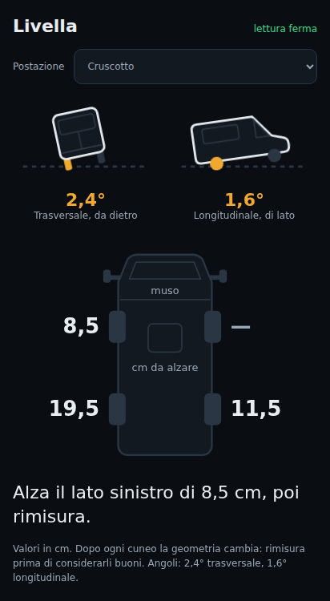
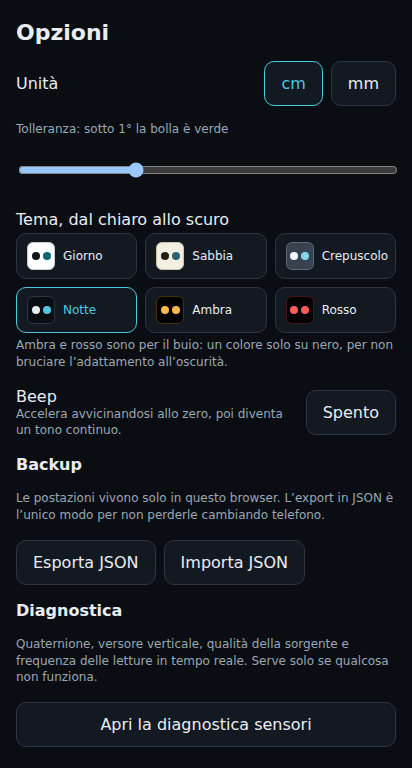
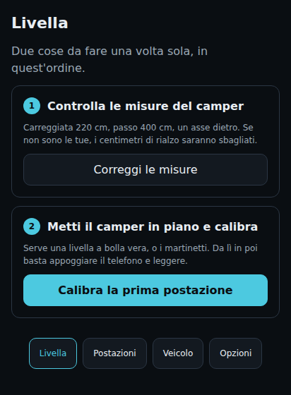
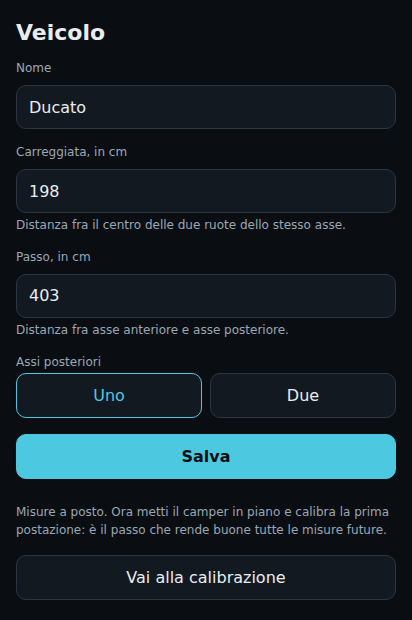
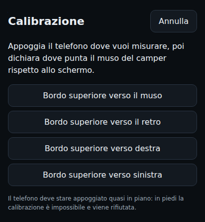

# Livella camper

Misura l'inclinazione del camper in piazzola e dice **di quanti centimetri
alzare ogni ruota**. Funziona nel browser del telefono, si installa come app e
non ha bisogno di internet: dopo il primo caricamento gira anche in modalità
aereo.

**→ [Apri l'app](https://mobbys.github.io/LivellaVanWeb/)**

<p>
  
  
</p>

## Cosa fa di diverso

Una livella qualsiasi misura l'inclinazione **del telefono**. Questa misura
l'inclinazione **del camper**, e sono due cose diverse: il cruscotto è
inclinato, il tavolo pende, il gradino è storto.

L'app impara una volta sola come è messo il telefono in quel punto — è la
*calibrazione* — e da lì in poi basta appoggiarlo dove capita di solito e
leggere. Non serve allinearlo, non serve pensarci.

Sapendo carreggiata e passo, converte i gradi nei **centimetri di cuneo** da
mettere sotto ogni ruota.

## Installazione

Apri l'indirizzo qui sopra **dal telefono**, poi:

- **Android (Chrome)** — menu ⋮ → *Aggiungi a schermata Home*. I sensori
  partono senza chiedere permessi.
- **iPhone (Safari)** — Condividi → *Aggiungi a Home*. Apri dall'icona e tocca
  **Attiva sensori**: iOS chiede il permesso una volta sola. Se non compare,
  controlla *Impostazioni → Safari → Movimento e orientamento*.

Esiste anche un **APK Android**, utile per installarla senza connessione:
*Actions → APK Android → Run workflow*, poi scarica l'artifact. Stessa
precisione della versione web, cambia solo il modo di distribuirla.

## Primo setup

Due cose, una volta sola, **in quest'ordine**. Alla prima apertura l'app te le
presenta già come due passi numerati, e ti mostra le misure attuali del camper
proprio lì, nel momento in cui contano.

<p></p>

### 1. Le misure del camper

**Veicolo** → carreggiata e passo in centimetri, e quanti assi hai dietro.

- **Carreggiata**: distanza fra i centri delle due ruote dello stesso asse.
- **Passo**: distanza fra asse anteriore e posteriore. Con due assi dietro,
  fino al centro del tandem.

Se le salti, l'app calcola i centimetri per un camper generico e i numeri
saranno sbagliati senza che niente lo dica.

<p></p>

### 2. La calibrazione

Metti il camper **davvero in piano**, con una livella a bolla vera o con i
martinetti. È il passo che conta: se il camper non è in piano adesso, ogni
misura futura sarà sbagliata della stessa quantità.

Poi appoggia il telefono dove lo terrai sempre e dichiara **verso dove punta il
muso rispetto allo schermo**. È la domanda che si capisce meno leggendola, ma
davanti al telefono è immediata: guarda il bordo superiore dello schermo e
chiediti dove va a finire.

<p></p>

Tieni fermo due secondi, dai un nome, ed è fatta.

Il telefono deve stare appoggiato **quasi in piano**: fino a 78° di
inclinazione va bene, oltre la calibrazione è matematicamente impossibile e
viene rifiutata.

Se la barra non parte, sotto trovi l'oscillazione misurata e la soglia che
serve: dopo otto secondi l'app propone di misurare comunque, perché su certi
telefoni il rumore del sensore non scende mai sotto quel valore.

## Come si usa in piazzola

1. Appoggia il telefono nella postazione calibrata.
2. Controlla che il selettore in alto mostri **quella giusta**.
3. Segui la riga grande.
4. **Rimisura dopo ogni cuneo.**

### Cosa c'è sullo schermo

| Elemento | A cosa serve |
|---|---|
| **I due camper inclinati** | Da dietro il trasversale, di lato il longitudinale. La ruota che scende sotto la linea tratteggiata è quella da alzare. |
| **La riga grande** | La mossa da fare adesso. È quella da seguire. |
| **Lo schema dall'alto** | Quanto manca a ogni ruota. Il trattino è la ruota già più alta: non si tocca. |

Le ultime due non sono in contraddizione, sono due strategie. La riga grande
segue il modo in cui si lavora davvero — prima si raddrizza il trasversale
mettendo **entrambe le ruote di un lato** sullo stesso cuneo, poi si pensa
all'asse — e ti dà una mossa per volta. Lo schema è la soluzione in un colpo
solo, se preferisci un cuneo diverso sotto ogni ruota.

Il disegno **amplifica l'inclinazione cinque volte**, altrimenti i pochi gradi
che contano non si vedrebbero. Il numero sotto è quello misurato.

### Perché «rimisura» è scritto ovunque

Appena infili un cuneo la geometria cambia: il camper ruota attorno a un'altra
ruota e i numeri di prima non valgono più.

## Postazioni

Una postazione è un punto d'appoggio: cruscotto, tavolo, gradino. Ognuna ha la
sua correzione e va calibrata una volta sola. Se sposti il telefono, **cambia
postazione** dal selettore, altrimenti misuri con la correzione sbagliata.

**Rifai in bolla** rimisura una postazione esistente senza crearne una nuova.
Le postazioni che erano state *trasferite* da quella vengono corrette con lo
stesso scarto: avevano ereditato il suo errore, e lasciarle indietro
significherebbe tenersi in casa misure sbagliate.

### Trasferimento

Serve ad aggiungere una postazione **senza rimettere il camper in bolla**.
Parti da una già calibrata, premi inizia, sposta il telefono nel nuovo punto,
conferma entro 90 secondi. Il giroscopio ha seguito il percorso della tua mano
e l'app ne ricava la nuova correzione.

Il camper deve restare **fermo**: non uscire e non far salire nessuno. Se lo
schermo si spegne il riferimento è perso e la procedura si annulla da sola.

Su alcuni telefoni — spesso gli iPhone — il riferimento assoluto non è
abbastanza stabile: l'app se ne accorge, lo dice e disattiva il trasferimento
invece di dare un risultato inaffidabile. In quel caso si calibra in bolla.

## Dove appoggiare il telefono

Conta più di quanto sembri, e non per il motivo che ci si aspetta.

Un supporto **inclinato** va benissimo, anche a 45° o 60°: la calibrazione
assorbe la posa e la misura resta esatta. Quello che conta è che sia
**ripetibile**, perché gli errori si pagano in modo molto diverso:

| Se lo riappoggi... | Errore su 4 m di passo |
|---|---|
| inclinato di 1° in più | **7 cm** |
| inclinato di 2° in più | **14 cm** |
| ruotato di 20° sul piano | quasi nulla a camper in bolla |

Un grado di inclinazione in più, che a occhio non vedi, vale sette centimetri
di cuneo sbagliato. Scegli un punto piano e ben definito — un ripiano, il
tavolo, una mensola — dove il telefono si ferma sempre allo stesso modo.

Prova gratis: a camper fermo togli il telefono, rimettilo, e guarda se i numeri
tornano uguali. Se ballano di mezzo grado, quel posto non va bene.

## Opzioni

- **Unità**: centimetri o millimetri.
- **Tolleranza**: sotto questo angolo la bolla diventa verde.
- **Tema**: sei, dal chiaro allo scuro. *Giorno* per il pieno sole, *Ambra* e
  *Rosso* per il buio — un colore solo su nero, per non bruciare l'adattamento
  all'oscurità.
- **Beep**: accelera avvicinandosi allo zero e diventa continuo quando sei
  arrivato, con una soglia regolabile indipendente da quella della bolla. Serve
  quando sei fuori con i cunei e lo schermo non lo guardi.
- **Backup**: le postazioni vivono solo in quel browser. L'export JSON è
  l'unico modo per non perderle cambiando telefono.
- **Diagnostica**: quaternione, versore verticale, qualità della sorgente e
  frequenza delle letture. Serve solo se qualcosa non funziona.

## Precisione

Target ±0,3° dopo il filtraggio, che su 2,2 m di carreggiata sono circa ±1,2 cm.
I valori sono arrotondati a mezzo centimetro: sotto quella soglia, con dei cunei
sotto le ruote, il numero non significa più niente.

---

## Per chi guarda il codice

Svelte 5 + TypeScript + Vite, nessuna dipendenza runtime oltre Svelte. Bundle di
circa 33 kB gzippati.

```bash
npm install
npm run dev            # server di sviluppo
npm test               # Vitest
npm run test:coverage  # copertura di src/core/, soglia 100%
npm run typecheck      # svelte-check
npm run build          # produzione in dist/
```

| Cartella | Contenuto |
|---|---|
| `src/core/` | La matematica. TypeScript puro: niente `window`, niente DOM, niente Svelte. Coperta al 100% dai test. |
| `src/sensors/` | Sorgenti di orientamento (Generic Sensor API, con fallback su `DeviceOrientationEvent`) e wake lock. |
| `src/store/` | Stato reattivo, veicolo, postazioni, persistenza con migrazione dello schema. |
| `src/ui/` | Schermate. `format.ts` è l'unico posto dove metri e radianti diventano centimetri e gradi. |
| `android/` | Guscio Capacitor per l'APK. |

La regola non negoziabile è la prima riga della tabella: la correttezza sta
tutta in `src/core/`, ed è l'unica parte dimostrabile. Ogni modifica alla
matematica parte da un test che fallisce.

Convenzioni fisse: assi camper X a destra, Y verso il muso, Z in alto; unità SI
internamente; matrici `Mat3` row-major; `R` mappa telefono→mondo; la matrice di
postazione `M` soddisfa `u_c = M · u_p`.

I test coprono anche cose che non sono matematica pura ma si possono comunque
misurare: i contrasti WCAG dei temi vengono letti dal CSS vero, e la
sensibilità alla posa del telefono è verificata numericamente.

### Pubblicazione

Ogni push su `main` ripubblica su GitHub Pages. Il `base` di Vite è
`/LivellaVanWeb/`; per l'APK va azzerato con `APP_BASE=/`, altrimenti dentro il
guscio nativo gli asset danno 404.
